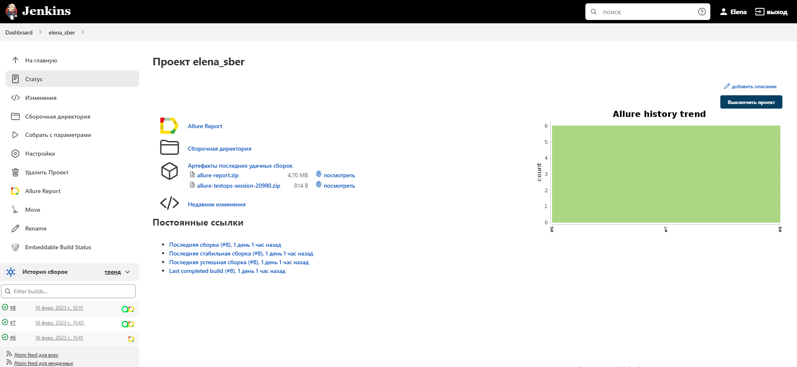
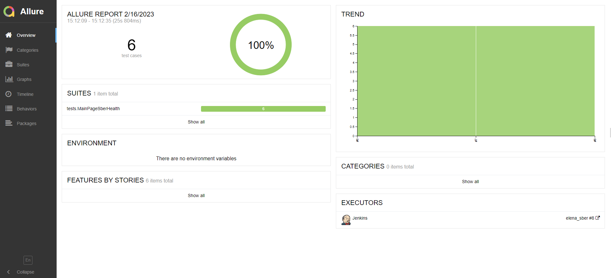
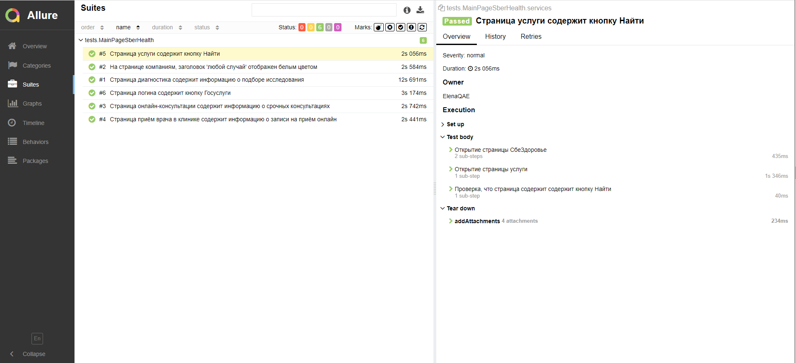
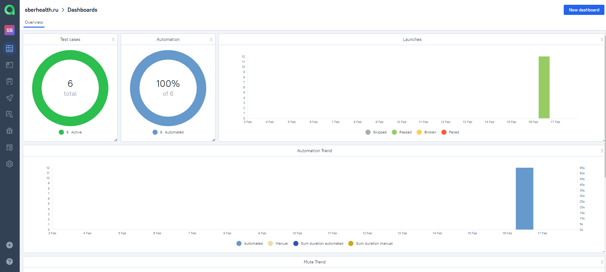
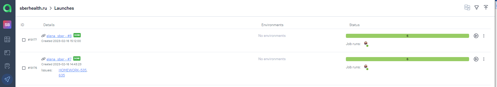
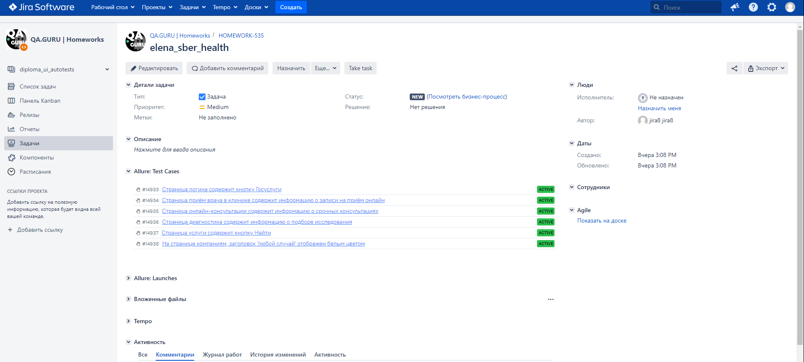
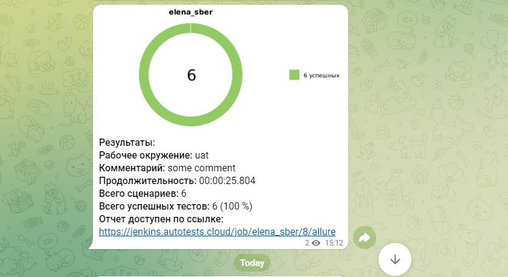

# Проект по автоматизации тестирования главной страницы sberhealth.ru


## :woman_health_worker:: Содержание:

- [Стек технологий](#earth_africa-Стек-технологий)
- [Реализованные проверки](#earth_africa-Реализованные-проверки)
- [Сборка в Jenkins](#earth_africa-Jenkins-job)
- [Запуск из терминала](#earth_africa-Запуск-тестов-из-терминала)
- [Allure отчет](#earth_africa-Allure-отчет)
- [Интеграция с Allure TestOps](#earth_africa-Интеграция-c-Allure-TestOps)
- [Интеграция с Jira](#earth_africa-Интеграция-c-Jira)
- [Уведомления в Telegram](#earth_africa-Уведомление-в-Telegram-при-помощи-бота)
- [Видео примеры прохождения тестов](#earth_africa-Примеры-видео-о-прохождении-тестов)

## :closed_book:: Стек технологий

<p align="center">
<a href="https://www.jetbrains.com/idea/"></a>
<a href="https://www.java.com/"></a>
<a href="https://github.com/"></a>
<a href="https://junit.org/junit5/"></a>
<a href="https://gradle.org/"></a>
<a href="https://selenide.org/"></a>
<a href="https://aerokube.com/selenoid/"></a>
<a href="https://github.com/allure-framework/allure2"></a>
<a href="https://https://qameta.io/"></a>
<a href="https://www.jenkins.io/"></a>
<a href="https://https://telegram.org/"></a>
</p>

## :stethoscope:: Реализованные проверки

Автаматизированные тесты
- ✓ Страница логина содержит кнопку Госуслуги
- ✓ Страница приём врача в клинике содержит информацию о записи на приём онлайн
- ✓ Страница онлайн-консультации содержит информацию о срочных консультациях
- ✓ Страница диагностика содержит информацию о подборе исследования
- ✓ Cтраница услуги содержит кнопку Найти
- ✓ На странице компаниям, заголовок 'любой случай' отображен белым цветом

## </a> Сборка <a target="_blank" href="https://jenkins.autotests.cloud/job/elena_sber//"> Jenkins </a>
<p align="center">
<a href="https://jenkins.autotests.cloud/job/elena_sber/"></a>
</p>

## :test_tube:: Параметры сборки в Jenkins:
- remote (адрес удаленного сервера)
- browser_size (размер окна браузера, по умолчанию 1920x1080)
- browser_version (версия браузера, по умолчанию 100.0)
- browser (браузер, по умолчанию chrome)

## :syringe:: Запуск тестов
Локальный запуск:
```
gradle clean test
```

Удаленный запуск:
```
clean
test
-Dremote=${REMOTE}
-DbrowserSize=${BROWSER_SIZE}
-DbrowserVersion=${BROWSER_VERSION}
-Dbrowser=${BROWSER}
```

## </a> Allure отчет <a target="_blank" href="https://jenkins.autotests.cloud/job/IBS_test/allure/"></a>

## :chart_with_upwards_trend:: Основной отчет
<p align="center">

</p>

## :pill:: Пример тест кейса
<p align="center">

</p>

## </a> Интеграция с Allure TestOps <a target="_blank" href="https://allure.autotests.cloud/project/1858/dashboards"></a>

## :framed_picture:: Доска
<p align="center">

</p>

## :rocket:: Запуски
<p align="center">

</p>

## </a> Интеграция с Jira <a target="_blank" href="https://jira.autotests.cloud/browse/HOMEWORK-519"></a>

<p align="center">

</p>

## </a> Уведомления в телеграм с использованием бота

<p align="center">

</p>

## </a> Selenoid. Пример прогона тестов. <a target="_blank" href="https://selenoid.autotests.cloud/gif/example.gif"> </a>

<p align="center">
 
</p>


